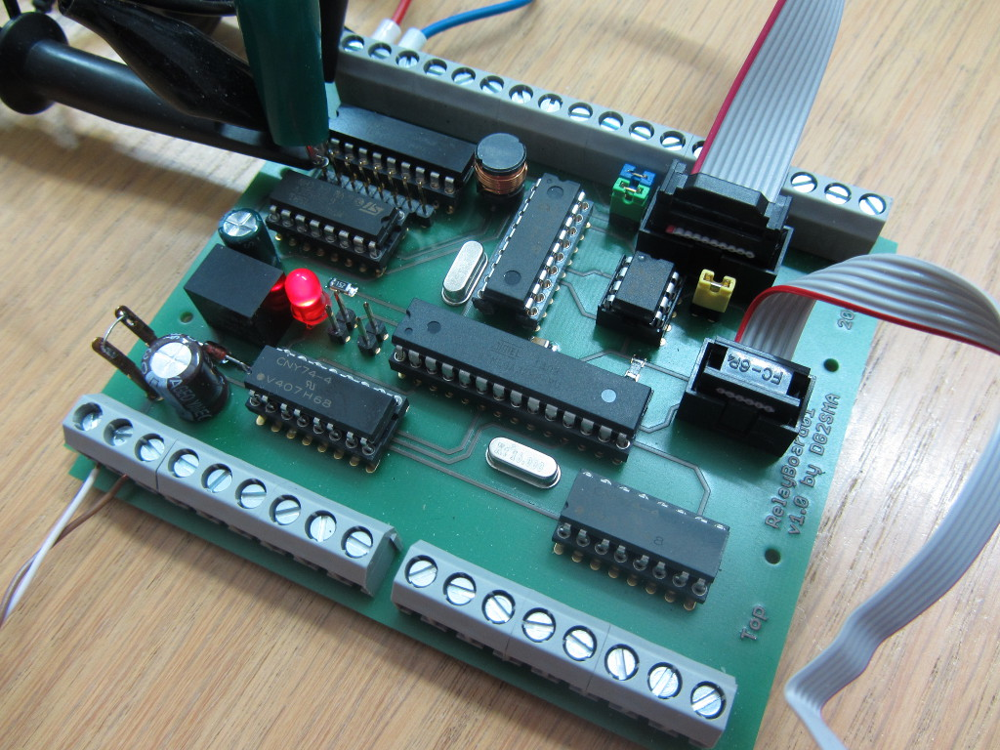

# Relay Board 01 <!-- omit in toc -->

The board is a VSCP node for the CAN-bus and controls several relays, which are external connected.

## Principle Flows

### Pushbutton

### Relay

### Shutter

# Used Libraries

| Library | Description | License |
| - | - | - |
| [Arduino](https://github.com/arduino/ArduinoCore-avr) | Arduino AVR Boards | LGPL |
| [PlatformIO](https://platformio.org) | PlatformIO is a cross-platform, cross-architecture, multiple framework, professional tool for embedded systems engineers and for software developers who write applications for embedded products. | Apache-2.0 |
| [VSCP L1 Framework](https://github.com/BlueAndi/vscp-framework) | The Very Simple Control Protocol (VSCP), an open and free protocol for IoT/m2m automation tasks. | MIT |

# Issues, Ideas And Bugs
If you have further ideas or you found some bugs, great! Create a [issue](https://github.com/BlueAndi/RelayBoard01/issues) or if you are able and willing to fix it by yourself, clone the repository and create a pull request.

# License
The whole source code is published under the [MIT license](http://choosealicense.com/licenses/mit/).
Consider the different licenses of the used third party libraries too!

# Contribution
Unless you explicitly state otherwise, any contribution intentionally submitted for inclusion in the work by you, shall be licensed as above, without any
additional terms or conditions.
